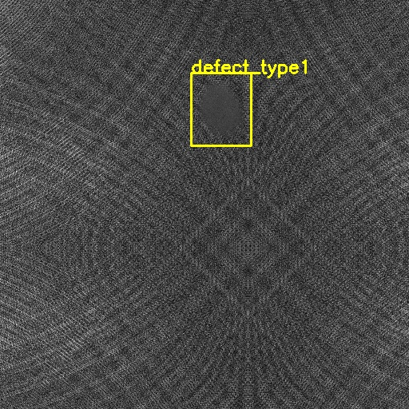
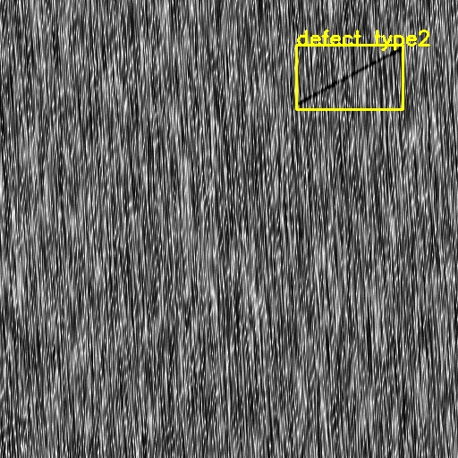
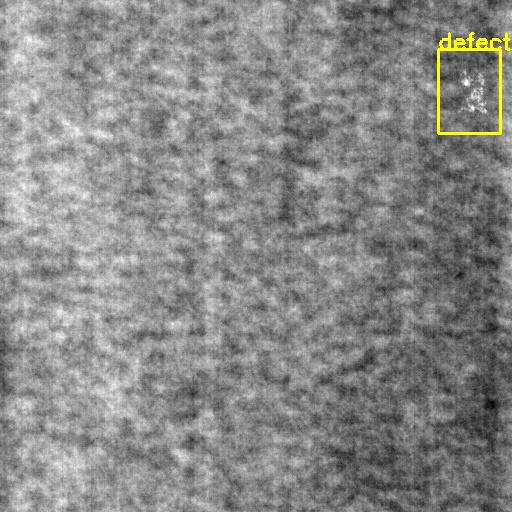

# A multi-output classification and object detection project using Pytorch


Ödevin ayrıntıları [readme.txt](readme.txt) dosyasında belirtilmiştir.

 - Öncelikle paylaşılan datasetten ve gerçekleştirilmesi gereken görevden bahsetmek gerekirse, 3 farklı sınıfa ait ve her bir sınıf için kusurlu ve kusursuz olmak üzere toplam 6 adet farklı veri tipi olduğu görülmektedir. İlk olarak görüntünün sınıfının ve kusurlu olup olmadığının tespit edilmesi gerekmektedir. Daha sonra kusurlu olduğu belirlenen fotoğraflarda kusurun nerede olduğu da tespit edilmelidir.
 
 ### Sınıflandırma Problemi
 Burada elde edilmek istenen sonucu göz önüne alınca, buradaki problem 3 ya da 6 sınıflı bir sınıflandırma probleminden çok, bir çıkışı 3 sınıfı diğer çıkışı ise görüntünün kusurlu olup olmadığını tahmin eden 2 çıkışlı bir sınıflandırma problemi gibi görünmektedir.
 
 Bu problemi daha hızlı çözmek için torchvision kütüphanesindeki resnet implementasyonunu kopyaladım ve buradaki resnet modellerini, sınıflandırma katmanlarını hariç tutarak sadece gövde(backbone) kısmını çıktı olarak verebilecek ve aynı zamanda bu modellerin önceden eğitilmiş (pretrained) ağırlıklarının da bu backbone'a yüklenebilir olacak şekilde yeniden düzenledim. [resnet.py](classification/resnet.py) dosyasında görülebilir.
 
 Daha sonraresnet18 modelinin backbone kısmını çıkardım ve önceden eğitilmiş bu gövdeye eklemek için bir sınıflandırma (classifier) katmanı yazdım ve her iki görev için birer tane ekleyerek, multi-output resnet modeli oluşturdum. [model.py](classification/model.py)
 
 Görüntü sınıfının belirleneceği taraf için CrossEntropyLoss fonksiyonunu kullandım. LogSoftmax fonksiyonunu da içerdiği için çoklu sınıflandırma modelleri için bu loss fonksiyonu sıkça kullanılmaktadır. Kusurlu olup olmamayı tespit eden taraf ikili (binary) bir problem olduğu için Binary Cross Entropy Loss fonksiyonunu kullandım.
 
 ### Kusurun Görüntüdeki Yerinin Tespiti
 Öncelikle kısıtlı süreden dolayı kusurları verildiği gibi elips olarak bulmak yerine bounding box formatına çevirip, klasik bir object detection modeli kullanmayı tercih ettim. Bunun için <https://github.com/Tianxiaomo/pytorch-YOLOv4> adresindeki yolov4'ün pytorch implementasyonundan yararlandım. Bu projede tanımlanmış fonksiyonları kullanarak, problemimiz görece daha basit olduğu için yolov4 yerine yolov4-tiny modelini implement ettim. bunun detaylarına da [detection](detection) klasöründen ulaşabilirsiniz. Bu model sadece tek bir "defect" sınıfında kusurları bulan bir model olarak da tasarlanabilirdi ama farklı hata tiplerinin farklı görüntülerde olabileceğini düşünerek 3 farklı hata tipi tanımladım. 
 
 ### Setlerin hazırlanması, Data Augmentation ve Eğitimler
 Öncelikle her bir klasör için verilerin 80%'i training kalanı da test verisi olarak ayrıldı. Yani her sınıf için 1-800 numaralı görüntüler train seti, 801-1000 numaralı görüntüler test seti olarak, aynı şekilde kusurlu görüntüler de 1-120 ve 121-150 şeklinde setlere ayrıldı. Kusurlu görüntüler oldukça az olduğundan ve eğitimlerde dengesizlik yaratabileceğinden dolayı kusurlu görüntülerin 120'şerlik eğitim dataları temel data augmentation metotları (flip, scale, rotate vb.)  kullanılarak 720'şer tane olacak şekilde çoğaltıldı. Aynı şekilde görüntülere ait bounding box'lar da transform edildi. Test dataları bu sürece katılmadı.
 
### Modellerin çalıştırılması
Bunun için öncelikle eğitilmiş modelleri indirmeniz gerekmektedir: google drive (https://drive.google.com/drive/folders/1fT8GUWOoynNSNsukl82WXxEDjjwJpFrS?usp=sharing)
 - Sınıflandırma:
"model_epoch_23.pth" şeklinde başlayan modeli indirip "checkpoints" isimli bir klasör açın ve içine koyun, daha sonra şu komutu çalıştırabilirsiniz:
```
python3 test_classifier.py checkpoints/model_epoch_23.pth data/test/class2_withdef/121.png
```

 - Kusur Tespiti
 "weights_best.pth" isimli dosyayı "detection" klasörü içine koyun ve şu satırı çalıştırın:
 ```
 python3 test_detection.py detection/weights_best.pth data/test/class2_withdef/121.png
 ```
 
 - İki modeli bütün olarak test edin:
 ```
 python3 test.py checkpoints/model_epoch_23.pth detection/weights_best.pth data/test/class2_withdef/121.png
 ```
 input görüntüyü değişirin ve farklı resimler üzerinde test yapın.
 
 bazı sonuçlar:
 
 
 
 
 
 
### Requirements
torch
torchvision
opencv-python
PIL
numpy
easydict
collections
matplotlib


